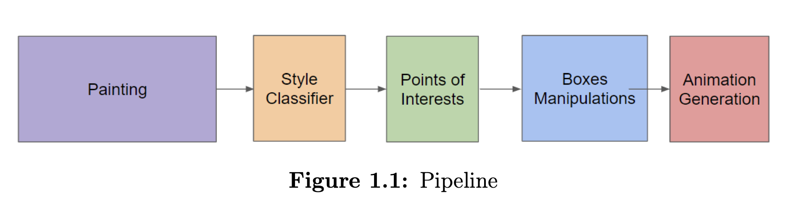

# Transverse project 2019-2020

The goal of our project is to transform a painting into a story. (to make a video with an image)

For the story to be interesting, we must detect regions of interest in the painting, using computer vision tools to analyse the image, before choosing a way to link these regions in a cinematographic way.

In the Figure we show the whole pipeline. We used style classification to choose a way to search for points of interest for two different types of images: abstract and figurative ones. For figurative paintings, we use state-of-the-art deep networks while for abstract one we use approaches from statistical analysis. These points of interests are then united in boxes to navigate in the animation.

Our main contribution is the pipeline and the algorithm for points of interests detection in abstract paintings. We also developed a python script to create sequential frames from images for animation or video based on the detections with operations of sliding, zooming and fading. 

##Dataset

We use a dataset from [WikiArt](https://www.kaggle.com/c/painter-by-numbers/overview), compiled for a Kaggle Competition, with more than 100,000 paintings and a total of 136 different styles. We divide styles on figurative and abstract ones. We use ResNet-34 to solve this binary classification problem.

## Regions of Interest
### Figurative

We use YOLO (J. Redmond) to find meaningful objects and depth estimation network from Adobe Research paper of Simon Niklaus et al. "3D Ken Burns Effect from a Single Image" 2019. Each detected box from YOLO has an assigned score of importance depending on the object and the depth which we got from depth network. This determines the order in which different regions will be shown in the animation. 

### Abstract

In order to find interesting features in an abstract painting, we look for statistically outstanding regions.
First, we crop randomly image to get about 400 patches. The size of the patch is adaptive to the size of the image and each contains about 3 percents of the whole area of the image.
For these patches we use HOG descriptor, CIELAB color space and VGG features to analyse the painting. HOG - histogram of gradient - describes the variations of gradients in the painting, when CIELAB describes color variations.
For more details check [abstract.py](abstract.py).

## Boxes Manipulations

Once all the points of interest are found, we use MeanShift clustering to unite close ones into one big region (in 3D space as we need depth as well).
For trajectory generation we use RANSAC algorithm (we search for objects on one line as they can be shown in a smooth linear transition)  

To create a video/animation we use two classes: Box and detection. 
(The code can be found respectively in Box.py and detection.py) The Point of Interests are stored as 
a detection object. It contains information about the class (if the image is realistic), its associates score depending 
on the category, its estimated depth, a confidence score (from the detector) and associated Box parameters: a box which 
was computed by the detector and a final box which we will be used for the animation. The final box 
is determined by the screen parameters which are expressed by width w and k = wh where h is image height.
Each box is defined by four numbers: two coordinates of the left upper corner and a width and a height. We released all the algebra for boxes including sum, subtraction, multiplication by a number, square, IoU (intersection square over union square for two boxes).
For successful choice of boxes which are used for animation we define a repeated pair of boxes two boxes whose IoU is more than 0.3. In case when a repeated pair is detected, we replace them by a bigger box.
During the tests we realized that sometimes zooming too much does not provide neither good animation neither story value itself. So the user can choose the maximum allowed zooming. By default this value is equal to 8. It gives a low bound for a box size - all boxes are modified so that their width is at least image width divided by max zoom which is 8.

For animation we released the following operations: 
- zoom from the full image
- sliding effect
- fading

All of them are released as functions with imput values of the original image and an initial and final boxes. They return list of frames (numpy arrays) for a corresponding operation.
In the figure you can see the illustration of how a "sliding" box move on the image to create an animation. The ratio of box width to box height stays constant while the size is changing to stress the point of interest. Basically this operation can be seen as zoom as well with the moving center.

## Results

See the examples of generated animations below:

"The Harvesters" by Pieter Bruegel the Elder

##Limitations

One of the main limitations we have is a memory constraint. The large paintings (starting from 3000 × 3000 pixels) should be divided into smaller ones to be analyzed on the stationary computer we used for the project.

Though first parts of the pipeline such as style can be used for a reduced image copy, if the goal is to see the whole story of the image (so all points of interests), a powerful machine should be used.

For now, we use only two styles classification to control the way of choosing points of 15 interest. 
Some of the styles are though a mix of both and, thus, it might be interesting to combine both of them or to come up with new ones. The absence of a data base with labeled points of interest did not allow us to evaluate on a big data set the performance of our POI detection. Thus, we are limited only by exhaustive analysis. It may be interesting to train YOLO specifically on paintings, or maybe to have several YOLO for different styles.